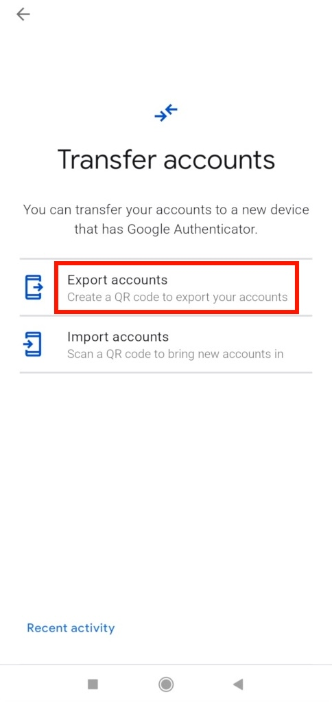
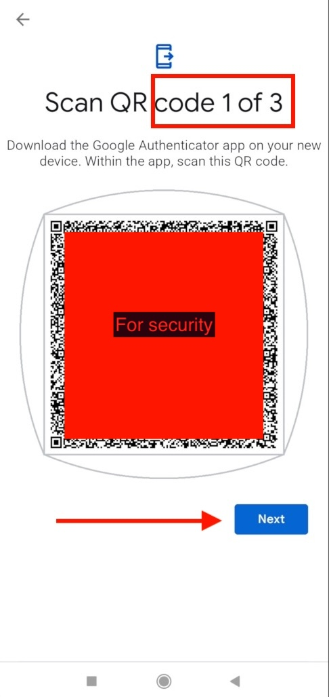

# Google Authenticator Exporter

[](LICENSE)

Google Authenticator Exporter is a tool to decode and export OTP (One-Time Password) codes from Google Authenticator OTPAuth migration URLs.

## Table of Contents

- [Introduction](#introduction)
- [Installation](#installation)
- [Usage](#usage)
- [License](#license)
- [Credits](#Credits)

## Introduction

Google Authenticator is a popular app for generating OTP codes for two-factor authentication (2FA). When you set up 2FA for an account using Google Authenticator, it provides you with an OTPAuth migration URL for backup purposes. This tool allows you to decode and export OTP codes from those migration URLs so you can import them back to another app or just for backup.

Key features:
- Decodes OTPAuth migration URLs.
- Exports OTP codes to a readable format.

## Installation

### Transfer accounts from Google Authenticator

1. From Google Authenticator app press the menu and select export accounts



2. Select the accounts you want to export.<br><br>

3. When QR codes step is shown, please notice if you have multiple codes see in the next screenshot



### Backup codes to txt files

1. From another phone scan the QR code and select save a txt file.

2. Transfer the txt files to your computer.

The best option is to go to the releases section and download the release matching your opearating system.

[https://github.com/yehudah/google-authenticator-exporter/releases/latest](https://github.com/yehudah/google-authenticator-exporter/releases/latest)

**Notice** 
----
No matter which installation method you choose, you must put your backup txt files in the code folder.

### Advanced / Developers

To use Google Authenticator Exporter, you'll need to have Go (Golang) installed on your system.

1. Clone this repository to your local machine:
```sh
git clone https://github.com/yehudah/google-authenticator-exporter.git
```

2. Change directory to the repository folder
```sh
cd google-authenticator-exporter
```

3. Run the Golang command line
```sh
go run .
```

## Usage

To use the Google Authenticator Exporter, run the following command:
```sh
./google-authenticator-exporter
```

## License
This project is licensed under the MIT License. See the LICENSE file for details.

## Credits
This development was inspired by the code located here: https://gist.github.com/mapster/4b8b9f8f6b92cc1ca58ae5506e0508f7
